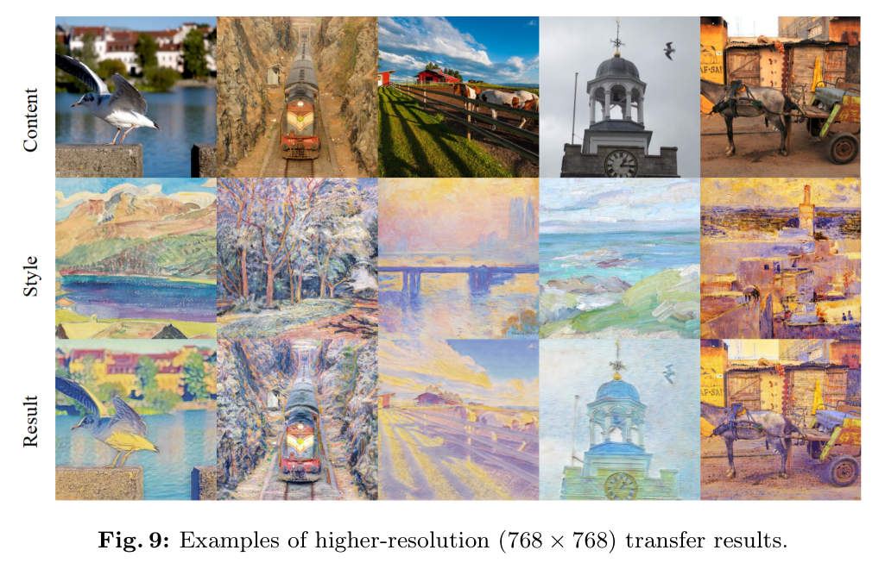
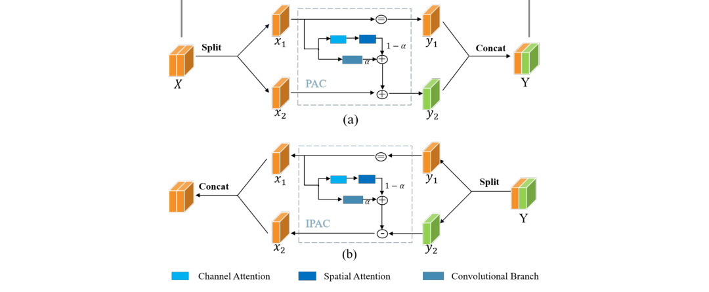

# InfoMinRev: Towards Compact Reversible Image Representations for Neural Style Transfer

[Paper](https://link.springer.com/chapter/10.1007/978-3-031-72848-8_15) • Project Page: `site/index.html` • Code: this repo

本仓库提供论文 *"Towards Compact Reversible Image Representations for Neural Style Transfer"* 的实现与训练/推理入口，包含模型结构、损失设计与高分辨率结果展示。

---

## Demo Results (High-Resolution)



## Model Architecture



---

## Paper Overview

论文从信息论视角解释风格迁移中的过度风格化与纹理不足问题，并提出以下核心设计：

- **InfoMinRev 模块**：可逆流式架构，通过模块间互信息最小化压缩冗余特征。
- **Barlow Twins 通道去相关**：减少通道耦合，增强内容表达能力。
- **Jensen–Shannon 风格分布对齐**：替代传统均值/方差 L2 风格损失，缓解过/欠风格化。

---

## Installation

推荐 Python 3.8+：

```bash
pip install torch torchvision pillow numpy
```

---

## Training

1. 修改配置：

```json
"data": {
  "content_dir": "/path/to/content",
  "style_dir": "/path/to/style"
},
"vgg": {
  "weights": "model/vgg_normalised.pth"
}
```

2. 启动训练：

```bash
python3 /Users/yixiao/Desktop/杨思宇-备份/infominrev_v3/scripts/train.py \
  --config /Users/yixiao/Desktop/杨思宇-备份/infominrev_v3/configs/default.json
```

---

## Inference / Stylization

```bash
python3 /Users/yixiao/Desktop/杨思宇-备份/infominrev_v3/scripts/stylize.py \
  --config /Users/yixiao/Desktop/杨思宇-备份/infominrev_v3/configs/default.json \
  --checkpoint /path/to/checkpoint.pth \
  --content /path/to/content_dir_or_image \
  --style /path/to/style_dir_or_image \
  --output /path/to/output_dir
```

---

## Loss Design

- **Content Loss**：使用 relu4_2 特征并归一化，确保结构一致性。
- **JSD Style Loss**：在特征均值/方差分布上进行 JSD 对齐，含 warmup 阶段。
- **Barlow Twins Loss**：约束通道相关性，减少冗余耦合。
- **Mutual Information Loss**：基于 KDE 的 NMI 最小化，压缩模块间冗余信息。

---

## Repository Structure

- `infominrev/`：核心包
- `infominrev/models/`：InfoMinRev + VGG 编码器
- `infominrev/losses/`：Content / JSD / Barlow / NMI-KDE
- `infominrev/engine.py`：训练引擎（Trainer）
- `infominrev/data.py`：数据与 DataLoader
- `configs/`：JSON 配置
- `scripts/`：训练与推理入口
 

---

## Citation

```
@inproceedings{infominrev,
  title={Towards Compact Reversible Image Representations for Neural Style Transfer},
  author={Liu, Xiyao and Yang, Siyu and Zhang, Jian and Schaefer, Gerald and Li, Jiya and Fan, Xunli and Wu, Songtao and Fang, Hui},
  booktitle={ECCV},
  year={2024}
}
```

---

## Acknowledgments

感谢原论文作者及相关开源基线（AdaIN / WCT / ArtFlow 等）为本项目提供理论与实现参考。
